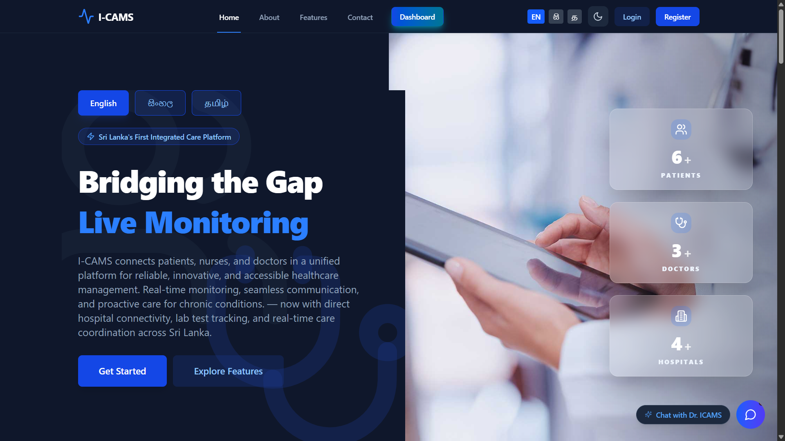

<div align="center">
  
  
  # 🏥 I-CAMS
  **Integrated Care Assessment and Monitoring System**
  
  *Bridging the gap in Sri Lankan healthcare with real-time monitoring and seamless coordination.*

  <br />

  
  
  
  
  
  
  
  
  
  
  
  

</div>

---

## 🌟 Overview

**I-CAMS** is a premium, three-tier healthcare management platform designed for multi-hospital environments. It unifies patients, doctors, nurses, and administrators into a single, cohesive ecosystem. Built with a focus on real-time data, security, and multilingual accessibility, I-CAMS is the first integrated care platform of its kind in Sri Lanka.

## 🏗️ Architecture

### Three-Tier Architecture

```
┌────────────────────────────────────────────┐
│          Frontend & Admin Panel             │
│     (React with Vite - Client Layer)        │
└────────────────────────────────────────────┘
                    ↓
┌────────────────────────────────────────────┐
│           Backend API Server               │
│    (Express.js - Application Layer)        │
└────────────────────────────────────────────┘
                    ↓
┌────────────────────────────────────────────┐
│          PostgreSQL Database                │
│        (Data Persistence Layer)             │
└────────────────────────────────────────────┘
```

## ✨ Core Features

### 👥 Multi-Role Ecosystem
- **Patients**: Health history tracking, appointment scheduling, and real-time monitoring.
- **Doctors**: Licensing verification, patient diagnostics, and electronic prescriptions.
- **Nurses**: Care coordination, vital logging, and staff scheduling.
- **Admins**: Centralized hospital management, analytics, and security controls.

### 🤖 Intelligent Assistant
- Powered by **Gemini 2.0 AI**, providing multilingual medical guidance and system assistance.

### 🌐 Global Accessibility
- Full support for **English**, **Sinhala**, and **Tamil**.
- Responsive glassmorphic UI designed for all devices.

### 🔌 Real-Time Communication
- **Socket.IO** for instant notifications and live updates across all connected devices.

## 🛠️ DevOps Practices

### Continuous Integration & Deployment (CI/CD)
- **GitHub Actions**: Automated workflows for building, testing, and deploying the application.
- **Automated Deployment**: One-click deployment to cloud platforms with GitHub Actions.
- **Version Control**: Best practices with Git including branching, pull requests, and code reviews.

## 🚀 Quick Start

### 1. Prerequisites
- **Node.js** (v18+)
- **PostgreSQL** (v15+)
- **npm** (v9+)

### 2. Installation
```bash
# Clone repository
git clone https://github.com/dulaj03/I-CAMS.git
cd I-CAMS

# Install all dependencies
cd backend && npm install
cd ../frontend && npm install
cd ../admin && npm install
```

### 3. Environment Setup
Configure your `.env` files in `backend/`, `frontend/`, and `admin/` using the provided `.env.example` templates.

### 4. Run Development
```bash
# Backend (Port 5000)
cd backend && npm run dev

# Frontend (Port 5173)
cd frontend && npm run dev

# Admin (Port 5174)
cd admin && npm run dev
```

## 🔒 Security First
- ✅ JWT-based authentication
- ✅ Password hashing with bcrypt
- ✅ SQL injection prevention (prepared statements)
- ✅ CORS protection
- ✅ Helmet for HTTP security headers
- ✅ Input validation & sanitization
- ✅ Secure file upload handling
- ✅ Environment variable management

---

## 📝 License

This project is licensed under the MIT License - see the [LICENSE](LICENSE) file for details.

---

### Contributors
- Dulaj (Lead Developer)

---

<div align="center">
  <p>Made with ❤️ by the I-CAMS Team</p>
  <p><b>Version 1.0.0</b> | <b>Last Updated: May 2026</b></p>
</div>
